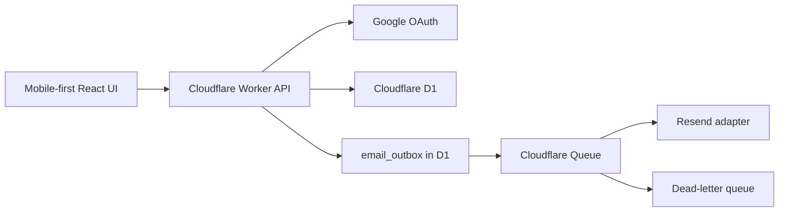

# Clubhouse Scheduler

## Corroboration summary

Five independent reviews agreed on the core stack and Topcoat omission. They also converged on several plan gaps now locked below: SPA/`run_worker_first` OAuth routing, unified day occupancy, email outbox (not dual-write enqueue), one-time admin bootstrap, product privacy matrix, and staging≠prod ops.

A second pass with [GPT Codex](ea955138-d640-4f24-aeb5-d8ec842a8c9c) and [Claude Sonnet](d3833179-83e3-4cf0-8a20-56549a2693d3) also validated the platform choices. Their launch-blocking corrections—explicit DLQ consumption, Cron-backed outbox sweeping, backward-compatible production migrations, and ongoing admin-role management—are incorporated below.

| Reviewer                                                        | Verdict                                                            |
| --------------------------------------------------------------- | ------------------------------------------------------------------ |
| [Cloudflare architecture](4300c524-420e-4993-b0bb-62822f774ae0) | Stack sound; tighten SPA routing, outbox, staging envs             |
| [Auth security](1445017d-85c0-4639-b40f-e1426274cfba)           | Direction right; harden OAuth/session/bootstrap/rate limits        |
| [Booking data model](16537260-6e1b-426f-b080-056bde6c6240)      | Product rules sound; need `calendar_days` + soft-cancel uniqueness |
| [Product UX](0b07ab08-db2e-49b5-8264-3b367d1e02de)              | Core flows covered; lock membership/privacy/a11y defaults          |
| [Testing/ops](d6357b4d-49f0-4566-ab04-17bd877040b2)             | Architecture solid; add CI, backups, email DLQ, HOA runbooks       |

## Architecture

- Scaffold a Git repository at `[/home/atucker/Projects/clubhouse-scheduler](/home/atucker/Projects/clubhouse-scheduler)` with Cloudflare's React/Vite Worker template and Hono `/api`.
- One Worker serves UI + API with:
  - `assets.not_found_handling = "single-page-application"`
  - `assets.run_worker_first = ["/api/*"]`
  - Google OAuth callback at `/api/auth/google/callback` (never a bare SPA path)
  - triple exports: `fetch` (Hono) + `queue` (main email and DLQ consumers) + `scheduled` (outbox sweeper)
  - Wrangler-generated `Env` types, `nodejs_compat`, and observability enabled
- Pin toolchain versions that support route-array `run_worker_first` (Wrangler `>=4.20.0`, Cloudflare Vite plugin `>=1.7.0`) and verify them in CI.
- Bindings: D1, Queue + DLQ, Cron Trigger, Rate Limiting, secrets/vars. Prefer Workers Paid for 30-day D1 Time Travel and longer queue retention.
- Separate Wrangler `staging` and `production` environments with distinct Worker names, D1 databases, queues, and secrets. Staging may use `workers.dev`; production uses a custom domain.

## Data integrity

- Persist calendar days as community-timezone civil dates (`YYYY-MM-DD`), not UTC instants.
- Enforce one occupied day via a `calendar_days` primary key (`kind` = booking or block). Detail rows live in `bookings` / `blocked_dates`.
- Soft-cancel bookings (`status = active|cancelled`) and use a partial unique index so cancelled history does not block rebooking.
- Core tables: `users`, `oauth_accounts`, `sessions`, `auth_states` (or encrypted cookie state), `addresses`, `calendar_days`, `bookings`, `blocked_dates`, `notifications`, `outbound_email_jobs`, `community_settings` (singleton), `audit_log` (append-only), optional `idempotency_keys`.
- Booking create / block / admin cancel run in a D1 `batch()`. Unique violations map to HTTP 409.
- Admin cancel transaction: cancel booking, free `calendar_days`, insert notification, insert `outbound_email_jobs` (`pending`). Queue send happens after commit; a scheduled Cron sweeper re-enqueues stuck pending jobs. Consumer is idempotent (`job.id` = Resend Idempotency-Key).

### Timezone and horizon rules

1. `today = formatInTimeZone(now, settings.timezone, 'yyyy-MM-dd')`
2. Bookable iff `today <= day <= today + horizon_days`, day free, user approved
3. Member cancel allowed when booking is active and `day >= today` (community TZ)
4. Shrinking horizon does not auto-cancel existing bookings
5. Defaults: timezone `America/Denver`, horizon `90` days (admin-editable)

## Product decisions (v1 lock)

- Address policy: allowlist + board approval is v1 (not a placeholder). Keep a `MembershipPolicy` seam for invite-code / auto-approve later.
- Household: multiple approved members may share one allowlisted address; v1 has no per-user/address booking cap (document explicitly; add later if needed).
- Pending: can sign in and select address; cannot view availability or book.
- Rejected: shown reason; may change address and resubmit; admin can ban.
- Suspended: cannot book; existing future bookings remain until admin cancels.
- Apple Sign In is out of v1 (Google only).
- No separate reschedule API; rebook = cancel + new booking.
- Fairness caps deferred.

### Calendar privacy matrix

| Viewer          | Day states returned                                                             |
| --------------- | ------------------------------------------------------------------------------- |
| Unauthenticated | No calendar                                                                     |
| Member          | `available` / `yours` / `unavailable` / `blocked` (+ public block message only) |
| Admin           | Identity/address on admin endpoints only                                        |

`unavailable` never includes name, email, user id, or address.

### Cancellation and rebooking

- Member self-cancel: audit only; no email blast.
- Admin cancel: in-app notification + queued email with rebook deep link.
- Rebook screen: requires auth; shows cancelled date + reason; preselects next 3 available dates in horizon; if none, links to full calendar; never auto-books.
- Block conflict: reject until explicit cancel. Admin UI may offer a confirmed cancel-then-block two-step; both mutations remain separately audited.

## Identity and security

- Google authorization-code as a confidential Worker client (client secret in Wrangler secrets) **plus** PKCE.
- Bind `state` ↔ `code_verifier` server-side (~10m TTL, single-use). Require `email_verified=true`. Upsert by Google `sub`. Do not store long-lived Google tokens.
- Session cookie: `__Host-session` (or equivalent), `HttpOnly`, `Secure`, `SameSite=Lax`, host-only, `Path=/`. Store only a hash of the session secret in D1. Absolute + idle TTL; rotate on login and role/status change; support revoke-all.
- CSRF: same-origin only; reject mutating requests whose `Origin`/`Referer` is outside an explicit allowlist; no open CORS.
- First-admin bootstrap: `BOOTSTRAP_ADMIN_EMAILS` elevates **only when zero admins exist**; never re-elevates afterward. The bootstrap admin then promotes a second board member through audited admin-role management before go-live. Prevent removing the last admin. Suspended users do not regain admin via bootstrap.
- Explicit `users.status`: `pending | approved | suspended | rejected` and `is_admin`. Enforce on every write route.
- Address allowlist search: authenticated + rate-limited; minimum fields only; never anonymous full dump.
- Workers Rate Limiting (or durable counters) on OAuth start/callback, address claim, booking writes, and admin mutations. Cap pending applications per account/address.
- Security headers for the Vite app (CSP tailored to the app, `Referrer-Policy`, `X-Content-Type-Options`).

## UI

Screens: sign-in, address onboarding, pending approval, rejection, calendar, booking detail, my bookings, notifications, rebook (including empty-state), profile, and admin (pending members, booking identity, cancel-then-block dialog, address list, role management, settings, audit, email delivery failures).

Mobile-first acceptance:

- Primary journeys usable at ~390px width
- Min 44×44px controls
- Calendar cells expose accessible names/states; status not by color alone
- Target WCAG 2.2 AA for sign-in, onboarding, calendar, book, cancel, notifications
- Playwright covers member book/cancel and admin cancel→rebook at mobile + desktop

## Environments, email, and ops

### Secrets and config

- Secrets per env: `SESSION_SECRET`, `GOOGLE_CLIENT_SECRET`, `RESEND_API_KEY`
- Vars per env: `GOOGLE_CLIENT_ID`, `APP_BASE_URL`, `BOOTSTRAP_ADMIN_EMAILS`, `EMAIL_FROM`, default timezone/horizon
- Provide `.dev.vars.example`; never commit secrets

### Email

- Verify Resend sending domain (SPF/DKIM/DMARC) before staging/prod
- Notification delivery status: `queued | sent | failed`; admin UI can resend
- Queue `max_retries` + DLQ. An explicit DLQ consumer updates the source-of-truth `outbound_email_jobs` row to `failed`, persists `last_error`, `failed_at`, and attempt count, and surfaces the failure/resend action to admins.

### Migrations, backups, CI

- Numbered D1 migrations; expand/contract for breaking changes
- Every production migration is expand-only and backward-compatible with both the currently deployed Worker and the next Worker. Destructive/contract migrations run only in a later release after the new code is stable.
- Before staging/prod migrate: capture D1 Time Travel bookmark
- CI on PR: typecheck, domain tests, D1 migration + integration tests, Playwright smoke
- Promote: migrate staging → smoke → migrate production → deploy Worker → smoke
- Rollback: app-only → Worker version rollback; bad migration/data → Time Travel to bookmark (rewinds all DB writes). Weekly encrypted D1 export beyond Time Travel window. Test restore on staging before cutover.

### HOA go-live checklist

- At least two admins before go-live
- Custom domain TLS, prod OAuth redirects, Resend domain verified
- Address allowlist is loaded before launch through a validated seed script from a board-provided CSV; runtime CSV upload is out of v1
- Runbooks: bootstrap, add/remove admins, suspend member, cancel+rebook, email failure resend, incident contacts
- Retention policy for sessions, notifications, audit_log; board export for disputes
- Staging restore drill completed

## Testing

- Domain: horizon, DST/timezone boundaries, permissions, block-vs-booking conflicts, privacy redaction
- D1: concurrent same-day booking → one 409; soft-cancel then rebook; cancel commits outbox even if queue send fails; migration on empty and seeded DBs
- Queue consumer: redelivery does not double-send; permanent provider errors → DLQ/failed
- Playwright: pending gate, member privacy, book/cancel, admin cancel→rebook at mobile/desktop
- CI uses mocked Google OAuth and Resend; staging smoke uses real OAuth + one real board-test email

